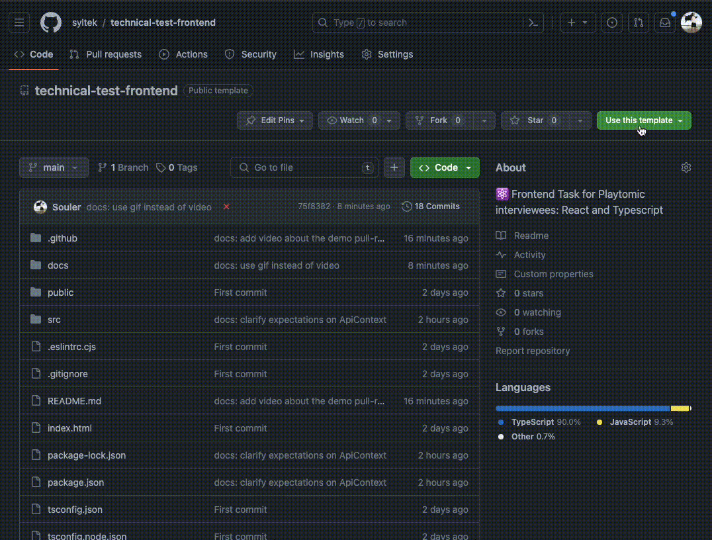

# Technical Task - Frontend

## Getting started

[Create a new repository](https://github.com/new?template_name=technical-test-frontend&template_owner=syltek&visibility=private) using this one as a template. Make sure set the repository visibility to **🔒 Private**.

<details>
<summary>See how</summary>



</details>

Now clone the repository you just created and run the following commands to install the project dependencies and get a dev-server running:

```
npm install
npm run dev
```

You can also run the project tests using this command:
```
npm test
```
> [!important]
> Some tests will fail if you run them right after cloning the repo; but they **should** be green after you are done with [Task 01](./docs//task-01.md)

Thats it! You are now ready to start with the [tasks](#tasks) or spend some time reading [what's included](#what-is-included-in-the-project) to get familiar with the project.

## Tasks

The test is divided in three mandatory tasks and one optional. The whole test is designed to be resolved in around three hours (not including the optional tasks).

- [X] **1.** Technical work: filling the gaps in the auth flow. [Link](./docs/task-01.md)
- [X] **2.** Product feature request: download all matches. [Link](./docs/task-02.md)
- [X] **3.** Pull Request review: showing correct dates. [Link](./docs/task-03.md)
- [X] **4.** _(optional)_ Technical work: auth refresh flow. [Link](./docs/task-04.md)

### Dos and don'ts

Every task has its own **Dos and Don'ts** section; but there are some things that are shared across all the tasks:

- You **should** commit **frequently** (even more than once per task) using **meaningful commit messages**.
- You **should** document some of the decisions you take while solving the challenge by writing them as a section on this README or as descriptions in the commit messages.
- You **should** consider using the available tooling before including an extra library or implementing your own.
- You **should** be consistent with your code-style.

## What is included in the project?

### Project structure

- `src/lib/`: Our _internal packages_. Each of this directories has an `index` which is considered its **entry-point**; no other part of the codebase should import from any given lib from a file other than the `index`.
- `src/lib/msw`: This a minimal mock server built using [msw](https://mswjs.io/docs). It allows us to simulate a realistic interaction with an API server without having to deploy anything extra. The directory includes a [README](./src/lib/msw/README.md) where you can find every endpoint we have available.
- `src/lib/api`: The data-fetching layer for the project. If you need to _talk_ with the API this is what you should be using. It has a lot of type-related goodies to make your developer experience better.
- `src/lib/api-types`: Some shared type definitions of entities returned by the API. No actual javascript here; just type definitions.
- `src/lib/auth`: Working directory and main focus of [Task 1](./docs/task-01.md).
- `src/views/`: The different views/pages of our application. These are components that take control of the **whole viewport** of the browser.

### Included 3rd-party libraries

- **[material-ui](https://mui.com/material-ui/getting-started/)**: Component library. For simplicity and speed; always try using the available components instead of writing your own implementations.
- **[swr](https://swr.vercel.app/)**: Data-fetching library react-aware.
- **[@testing-library/react](https://testing-library.com/docs/react-testing-library/intro/)**: Test framework for UI testing of React components.
- **[vitest](https://vitest.dev/api/)**: Test framework; including assertions and mocking.
- **[msw](https://mswjs.io/docs)**: A mock-server implementation that works on tests and on dev-mode; allowing us to have the same scenario for tests and development!
- **[react-router v5](https://v5.reactrouter.com/web/guides/quick-start)**
- **[react](https://react.dev/reference/react)**
- **[vite](https://vitejs.dev/guide/)**

## Notes
### About task #2

#### Batching matches before downloading
I have extensive experience working with large datasets, and it's crucial to avoid freezing the user interface while a report is being downloaded. In this case, we only have 21 rows, so the dataset is quite small. However, I’m confident that our customers will eventually need to download reports with much larger datasets.

In a real-world platform, it’s advisable to ask users to prepare their report by applying necessary filters before generating it (which, of course, should be handled on the backend). To mimic this behavior, I’ve proposed a two-step download process. In the first step, a job would be run on the backend to prepare the report. Once the report is ready, the backend would notify the frontend, allowing us to display a download button for the user.


#### Handling dates
Until task #3, I wasn’t aware that we had a bug in how dates are displayed in the table. I initially assumed that the current behavior was intentional, and in my opinion, it's actually a good approach to handle dates.
Let me explain: when a user books something (in this case, a tennis or padel court), they select both a date and a time. These should always be shown in the court's local timezone, not the user's timezone. To achieve this, we have two options: we can either work with timezones and ensure the date and time are displayed correctly, or we can treat the date as a UTC timestamp.

I assumed we were following the second approach. To enhance the user experience when working with the downloaded report, I retrieve the dates (as strings) and strip out the timezone information (in this case, the Z from the UTC format). Once the date is timezone-free, I can create a new Date object with the exact same date and time, but in the user’s timezone. This enables to easily display the date in the user’s local format.
